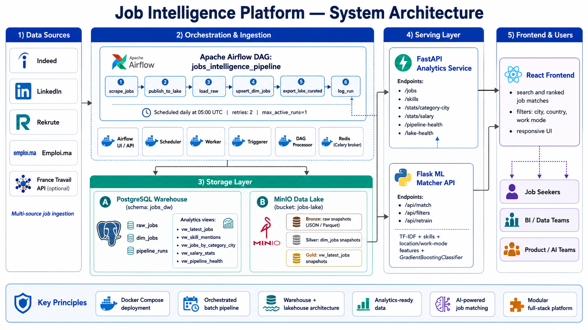

# Job Intelligence Platform

An end-to-end data platform that scrapes job listings from multiple sources across Morocco and France, stores them in a warehouse + lakehouse architecture, and serves them through analytics APIs and an AI-powered job matching frontend.



---

## Table of Contents

- [Overview](#overview)
- [Architecture](#architecture)
- [Tech Stack](#tech-stack)
- [Project Structure](#project-structure)
- [Getting Started](#getting-started)
- [Configuration](#configuration)
- [API Reference](#api-reference)
- [ML Job Matcher](#ml-job-matcher)
- [Frontend](#frontend)
- [Pipeline Details](#pipeline-details)

---

## Overview

The platform automates the full lifecycle of job market intelligence:

1. **Scrape** job listings daily from Indeed, LinkedIn, Rekrute, Emploi.ma, and France Travail
2. **Store** raw data in a MinIO data lake (Bronze/Silver/Gold layers) and a PostgreSQL data warehouse
3. **Orchestrate** the pipeline with Apache Airflow (scheduled daily at 05:00 UTC)
4. **Serve** analytics through a FastAPI service and ML-powered job matching through a Flask API
5. **Visualize** results in a React frontend with search, filters, and ranked job recommendations

---

## Architecture

The system is composed of five layers:

| Layer | Components |
|-------|------------|
| **Data Sources** | Indeed, LinkedIn, Rekrute, Emploi.ma, France Travail API |
| **Orchestration** | Apache Airflow DAG with 6 tasks (CeleryExecutor + Redis) |
| **Storage** | PostgreSQL warehouse (`jobs_dw` schema) + MinIO data lake (`jobs-lake` bucket) |
| **Serving** | FastAPI analytics API (port 8000) + Flask ML matcher API (port 5001) |
| **Frontend** | React + TypeScript app with job search and AI-ranked matching |

### Airflow DAG: `jobs_intelligence_pipeline`

```
scrape_jobs -> publish_to_lake -> load_raw -> upsert_dim_jobs -> export_lake_curated -> log_run
```

- **Schedule:** daily at 05:00 UTC
- **Retries:** 2 (10 min delay)
- **Max active runs:** 1

### Storage Schema

**PostgreSQL (`jobs_dw`):**
- `raw_jobs` - raw ingested data
- `dim_jobs` - deduplicated, enriched dimension table
- `pipeline_runs` - execution metadata

**Analytics views:**
- `vw_latest_jobs` - most recent job listings
- `vw_skill_mentions` - skill extraction and counts
- `vw_jobs_by_category_city` - category/city breakdown
- `vw_salary_stats` - salary analytics
- `vw_pipeline_health` - pipeline run monitoring

**MinIO Data Lake (`jobs-lake`):**
- `bronze/` - raw snapshots (JSON/Parquet)
- `silver/` - cleaned dim_jobs snapshots
- `gold/` - curated `vw_latest_jobs` exports

---

## Tech Stack

| Category | Technology |
|----------|------------|
| Orchestration | Apache Airflow 3.x, Celery, Redis |
| Database | PostgreSQL |
| Object Storage | MinIO (S3-compatible) |
| Analytics API | FastAPI, SQLAlchemy, Uvicorn |
| ML Matcher API | Flask, scikit-learn, GradientBoostingClassifier, TF-IDF |
| Scraping | BeautifulSoup, Requests, JobSpy |
| Frontend | React, TypeScript, Vite |
| Infrastructure | Docker, Docker Compose |
| Data Processing | Pandas, NumPy, boto3 |

---

## Project Structure

```
.
├── dags/
│   └── jobs_pipeline_dag.py      # Airflow DAG definition
├── scraper/
│   ├── job_sources.py            # Multi-source scraper orchestrator
│   └── sources/
│       ├── common.py             # Shared utilities, search terms, categories
│       ├── indeed.py             # Indeed scraper
│       ├── linkedin.py           # LinkedIn scraper
│       ├── rekrute.py            # Rekrute scraper
│       ├── emploi_ma.py          # Emploi.ma scraper
│       └── france_travail.py     # France Travail API client
├── api/
│   ├── main.py                   # FastAPI analytics service
│   ├── requirements.txt
│   └── Dockerfile
├── job_matcher_model_v2.py       # ML model training & inference
├── api_server.py                 # Flask matcher API server
├── frontend/
│   └── src/
│       ├── App.tsx               # React frontend
│       └── App.css
├── docker-compose.yaml           # Full stack deployment
├── Dockerfile.airflow            # Custom Airflow image
├── Dockerfile.matcher            # Matcher API image
├── requirements-airflow.txt      # Airflow Python dependencies
├── requirements-matcher.txt      # Matcher Python dependencies
├── .env.example                  # Environment variable template
└── docs/                         # Project documentation
```

---

## Getting Started

### Prerequisites

- Docker & Docker Compose
- At least 4 GB of free RAM (Airflow + supporting services)

### 1. Clone and configure

```bash
git clone <repository-url>
cd docker-dh
cp .env.example .env
```

Edit `.env` to set your credentials (France Travail API keys, source toggles, etc.).

### 2. Initialize Airflow

```bash
docker compose up airflow-init
```

### 3. Start the stack

```bash
docker compose up -d
```

This starts:
- **Airflow** (API server, scheduler, worker, triggerer) on `http://localhost:8080`
- **PostgreSQL** on port `5432`
- **Redis** (Celery broker)
- **MinIO** on `http://localhost:9000` (console: `http://localhost:9001`)
- **FastAPI Analytics** on `http://localhost:8000`
- **ML Matcher API** on `http://localhost:5001`

### 4. Start the frontend

```bash
cd frontend
npm install
npm run dev
```

The React app runs on `http://localhost:5173` by default.

### Default credentials

| Service | Username | Password |
|---------|----------|----------|
| Airflow | `airflow` | `airflow` |
| MinIO | `minioadmin` | `minioadmin123` |

---

## Configuration

All settings are managed through environment variables (see `.env.example`):

### Source Toggles

| Variable | Default | Description |
|----------|---------|-------------|
| `ENABLE_INDEED` | `1` | Enable Indeed scraping |
| `ENABLE_LINKEDIN` | `1` | Enable LinkedIn scraping |
| `ENABLE_REKRUTE` | `1` | Enable Rekrute scraping |
| `ENABLE_EMPLOI_MA` | `1` | Enable Emploi.ma scraping |
| `ENABLE_FRANCE_TRAVAIL` | `0` | Enable France Travail API (requires API keys) |

### MinIO / Lakehouse

| Variable | Default | Description |
|----------|---------|-------------|
| `ENABLE_MINIO_LAKE` | `1` | Enable lakehouse layer |
| `MINIO_ENDPOINT` | `http://minio:9000` | MinIO endpoint |
| `MINIO_BUCKET` | `jobs-lake` | Data lake bucket name |

### France Travail API

| Variable | Description |
|----------|-------------|
| `FRANCE_TRAVAIL_CLIENT_ID` | OAuth2 client ID |
| `FRANCE_TRAVAIL_CLIENT_SECRET` | OAuth2 client secret |

---

## API Reference

### FastAPI Analytics Service (port 8000)

| Endpoint | Method | Description |
|----------|--------|-------------|
| `/health` | GET | Health check |
| `/jobs` | GET | List jobs with filters (`category`, `city`, `country`, `remote`, `source`, `limit`) |
| `/skills` | GET | Top mentioned skills |
| `/stats/category-city` | GET | Job counts by category and city |
| `/stats/salary` | GET | Salary statistics |
| `/pipeline-health` | GET | Pipeline run history |
| `/lake-health` | GET | MinIO data lake status |

### ML Matcher API (port 5001)

| Endpoint | Method | Description |
|----------|--------|-------------|
| `/api/match` | POST | Get ranked job matches for a given profile |
| `/api/filters` | GET | Available filter values (cities, countries, skills, categories) |
| `/api/retrain` | POST | Retrain the ML model on latest data |

---

## ML Job Matcher

The matching engine uses a two-stage approach:

1. **TF-IDF + Cosine Similarity** - text-based relevance scoring between the user query and job descriptions
2. **GradientBoostingClassifier** - supervised model trained on job features (skills, location, work mode) for category prediction and ranking

**Features used:**
- Extracted skills from job descriptions (matched against a 90+ skill database)
- Location and work mode (remote/onsite/hybrid)
- Job category classification
- TF-IDF vectors on title + description

The model loads data from the PostgreSQL Gold layer (`vw_latest_jobs`) at runtime, with a static JSON fallback.

---

## Frontend

The React frontend provides:

- **Job search** by title, city, and work mode
- **AI-ranked results** from the ML matcher API
- **Filter options** loaded dynamically from the API (cities, countries, categories)
- **Responsive design** for desktop and mobile
- **Pagination** with 12 results per page

Data sources displayed: LinkedIn, France Travail, Emploi.ma, Indeed.

---

## Pipeline Details

### Search Coverage

The scraper targets 50+ job title variations across data engineering, analytics, cloud/DevOps, AI/ML, and software development roles. Searches run across multiple cities in Morocco and France.

### Data Flow

```
Sources -> scrape_jobs (JSON file)
        -> publish_to_lake (MinIO bronze layer)
        -> load_raw (PostgreSQL raw_jobs)
        -> upsert_dim_jobs (PostgreSQL dim_jobs with deduplication)
        -> export_lake_curated (MinIO silver + gold layers)
        -> log_run (pipeline_runs metadata)
```

### Job Classification

Jobs are automatically categorized into domains (Data Engineering, Data Science, Cloud/DevOps, Software Development, etc.) based on title pattern matching.

---
